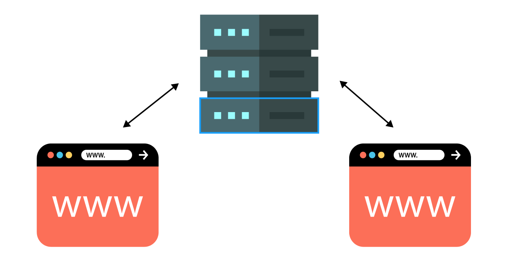
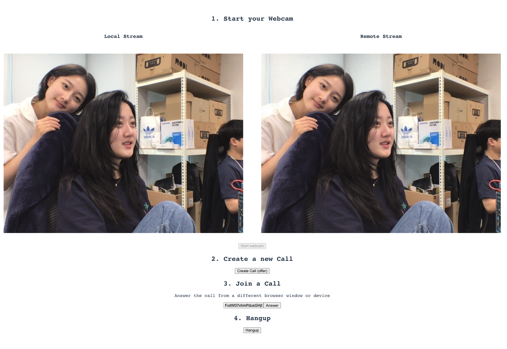

# React WebRTC with TypeScript example by Juwon Chun

## What is Web RTC?

Web RTC는 브라우저 상에서 사용자들끼리 Peer to Peer(P2P) 통신을 이용해 다이렉트로 비디오, 오디오, 챗 등을 주고받을 수 있게 해주는 API이다.

  
기존 웹에서는 통신을 위해서 사용자들 사이에 중간 서버를 거치게 된다.

  
WebRTC를 이용하면 중간 서버나 native 앱을 거치지 않고, P2P 통신을 이용해 미디어를 주고받을 수 있다.
<br /><br/>

### 중간서버를 거치지 않는다 !== 서버가 필요 없다.

여기서 중간 서버를 거치지 않는다는 말이 곧 서버가 필요 없음을 뜻하지는 않는다.  
Web RTC를 이용한 웹 어플리케이션 사용자의 관점에서는 브라우저 외에 아무것도 필요하지 않지만,  
Web RTC API는 시그널링을 수행하지 않기 때문에 개발자는 이를 위해 따로 동작하는 서버 측 솔루션을 만들어야 한다.

> **시그널링(Signaling)** : 미디어를 주고 받음에 있어서, Third-party 서버 없이 Peer to Peer로 통신할 수 있도록  
> 해당 통신 세션의 설정, 제어, 및 종료를 총괄하는 프로세스.

NAT환경에서 private IP를 할당받은 클라이언트가 WebRTC를 이용하고자 할 때, 사용자는 자신의 public IP를 필요로 한다.  
이를 위해 자신의 public IP를 파악하고 상대 peer에 데이터를 전송하기 위한 peer간의 응답 프로토콜인 Ice(Interactive Connectivity Establishment) 프로토콜을 이용하며 이 프로토콜은 STUN서버를 이용해 구축할 수 있다.  
예를 들어, 사용자1과 사용자2가 서로간의 P2P 커넥션을 위해 STUN서버로 리퀘스트를 보내면, 이 서버는 응답값으로 요청을 보낸 클라이언트의 public IP와 포트를 보내주고,  
동시에 연결된 데이터베이스에 모든 참여자가 읽을 수 있도록 저장한다.
이후 서버 알고리즘이 어떤 candidate와의 연결이 가장 효율적일지 계산 해 연결을 주선해준다.

> **STUN(Session Traversal Utilities for NAT)** : 방화벽이 설치된 NAT 환경에서 Ice 프로토콜 구축을 위해 사용하는 서버.

<br/><br/>

## How does it work?

Web RTC를 이용해 영상통화를 하고 싶은 _Tom_ 과 _Kaye_ 가 있다고 하자.  
*Tom*이 오퍼를 만들어 *Kaye*에게 채널 id를 보내고, *Kaye*는 받은 id로 오퍼에 응답하여 영상통화를 진행하려 한다.  
이 때 *Tom*과 _Kaye_ 각각의 side에서 일어나는 과정을 예시로 들어보려고 한다.
<br />

### _Tom_'s side

1.  ```
       const servers = {
               iceServers: [
                 {
                     urls: ['stun:stun1.l.google.com:19302', 'stun:stun2.l.google.com:19302'],
                 },
               ],
               iceCandidatePoolSize: 10,
             }
        let pc = new RTCPeerConnection(servers); // pc Object가 바로 where all the actions happen!!

    ```

    무료 STUN 서버로 servers를 설정해주고 , 전역변수로 pc를 선언 후 [RTCPeerConnection()](https://developer.mozilla.org/ko/docs/Web/API/RTCPeerConnection)을 할당해  
     _Kaye_ 와의 WebRTC 연결을 준비한다.

2.  `const localStream = navigator.mediaDevices.getUserMedia() ` // 내 미디어 소스를 set up 한다.
3.  `const remoteStream = new MediaStream()` // *Kaye*의 영상을 받아와서 송출한 미디어 소스도 set up 한다.
4.  ```
    pc.ontrack = (event) => {
      event.streams[0].getTracks().forEach((track) => {
        remoteStream.addTrack(track);
      });
    };
    ```
    앞서 선언한 `remoteStream` 에 *kaye*와의 연결에서 받아 온 트랙을 추가해준다.
5.  ```
        const callDoc = firestore.collection('calls').doc()
        let offerCandidates = callDoc.collection('offerCandidates')
        let answerCandidates = callDoc.collection('answerCandidates')

    ```

    시그널링 후 생성된 offer에 대한 key값을 받아 저장하기 위해 데이터베이스가 연결된 서버(해당 demo에서는 firebase와 firestore 이용함)를 연결한다.

6.  ```
    const offer = {
      sdp: offerDescription.sdp,
      type: offerDescription.type,
    }

    await callDoc.set({ offer })
    ```

    오퍼를 생성한다.

7.  ```
      const answerDescription = new RTCSessionDescription(data.answer)
      pc.setRemoteDescription(answerDescription)
      answerCandidates.onSnapshot((snapshot) => {

      // candidate를 피어 커넥션에 추가하는 부분
      snapshot.docChanges().forEach((change) => {
          if (change.type === 'added') {
            const candidate = new RTCIceCandidate(change.doc.data())
            pc.addIceCandidate(candidate)
          }
        })
      })
    ```

    *kaye*로 부터 응답을 받을 준비를 해두고, 응답을 받게되면 해당 candidate를 피어 커넥션에 추가해준다.  
     <br /><br /><br />

### _Kaye_'s side

1. `const roomId = 123123` <= 처럼, *Tom*으로부터 받은 roomId를 변수에 저장한다. (혹은 간단히 input 엘리먼트에 입력도 ok, 구현하기 나름)

2. ```
    const answerCandidates = callDoc.collection('answerCandidates')
    pc.onicecandidate = (event) => {
           event.candidate && answerCandidates.add(event.candidate.toJSON());
         };
   ```
   *Tom*과 같이 `RTCPeerConnection()` 을 사용하여 WebRTC 연결을 준비하고, 서버의 answerCandidate 콜렉션의 자신의 Ice 정보를 저장한다.
3. ```
   const answer = {
         type: answerDescription.type,
         sdp: answerDescription.sdp,
    }
   ```
   위와 같이 보낼 응답의 타입과 SDP를 정의하고, 피어 커넥션의 Ice Candidate에 자기 자신을 추가해주는것으로 연결은 끝이 난다.

### Example

  
(사이좋은 우리 🥰)
